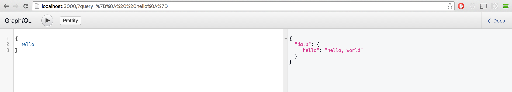
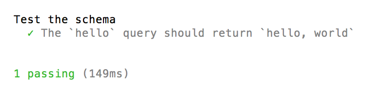

# Creating a workflow for node.js containing a GraphQL API

So you want to implement a [graphQL](http://graphql.org/) api on node.js but are unsure where to begin? Then keep reading:) 

In this tutorial I want to share what I have learned about setting up a node.js project that contains a graphQL API. 

More specifically, I want to explain how to: 

- Set up a simple `Hello, world` graphQL API in node.js
- Create a workflow for developing, testing and deploying your node.js codebase. 

This turorial is based on a node.js GraphQL starter project on [Github](https://github.com/HiThereCommunity/example-graphql-server).

I have used this starter project several times and it has allowed me to develop an API relatively quickly. In addition, the workflow has lowered my development time and increased the stability of my codebase.

I hope that you will find this tutorial useful! Feel free to give suggestions and feedback on how to improve it.

#Prerequisites

Make sure that you have node.js installed. You can install node.js from [here](https://nodejs.org/en/).


#Creating the project

Create a new folder for your project on your computer. For sake of this tutorial let's call it `project` 

```
$ mkdir project
```

Next, open the newly created folder and create the `src` folder that will contain all the source code for the server.

```
$ cd project
$ mkdir src
``` 

Next, create a `package.json` folder that will contain all your `node` dependencies (libraries that you import). We will also write all the development, testing and build scripts in this file.

```
$ npm init -f 
```

You should now have a package.json in the `project` directory. 

#Installing babel

Before we can start writing some code for our server we first need to install [Babel](https://babeljs.io/) for compiling our next-generation javascript. Add babel to your development dependencies using the following commands:

```
$ npm install --save-dev babel-cli
```


We will also add some Babel [presets](http://babeljs.io/docs/plugins/#presets) using the following commands:

```
$ npm install --save-dev babel-preset-es2015
$ npm install --save-dev babel-preset-stage-2
```

Finally, we need to add a `.babelrc` file that contains all the `Babel` settings.

```
$ touch .babelrc
```

Add the following to the babelrc file: 

```json
{
  "presets": ["es2015", "stage-2"],
}
```

# Creating the server code

Next, we will write some code to start up the node.js server. Create the `index.js` file in the `src` folder. This file will be used to start up the node server.

```
$ touch src/index.js
```

We will use [express](http://expressjs.com/) to create a Node.js server. Install `express` as follows: 

```
$ npm install --save express
```

```javascript
import express from 'express';
const app = express();

var server = app.listen(3000, function () {

  var port = server.address().port;
  console.log('App listening at http://localhost:%s', port);
});
``` 

We now have our server-side code. Next, we will write our first script to start up the server. Open the `package.json` and add a script that runs the code in `src/index.js` and compiles it using `babel`.

```json
"scripts": {
	"start": "babel-node src/index.js"
}
```

We can now run our server by simply invoking the script we just wrote: 

```
$ npm run start
```

The following message should appear in your console: `App listening at http://localhost:3000`. You have now successfully started up your node server.

# Creating a development workflow

In its current form it would be very hard to work on our server code. We would have to invoke the `npm run start` script anytime that we want to test some functionality that we add to our server. 

Thankfully, [Nodemon](https://github.com/remy/nodemon) can help us here. Nodemon is a tool that monitors your node.js server for changes in the code. Anytime a change is made, it automatically restarts the server.

Install nodemon as a dependency

```
$ npm install --save-dev nodemon
```

Now we will update our build script to include `Nodemon`: 

```json
"scripts": {
	"start": "nodemon src/index.js --exec babel-node"
}
```

Run the script and the server should start up, you should see `[nodemon]` appear in your console.

Nodemon, is quite cool. To see it in action open up the `src/index.js` file and change the console log statement from  `App listening at...` to 

```js
 console.log('Hello, world!');
```

Save the file and the server should restart and output the new log statement in the console.

We have now successfully created a development workflow!

# Creating a GraphQL endpoint

We now have a running server with a development workflow. Let's create the `GraphQL` server. 

First we need to install [graphql-js](https://github.com/graphql/graphql-js):

```
$ npm install --save graphql
```

Next, we need to install [express-graphql](https://github.com/graphql/express-graphql). This will allow us to easily build our graphQL endpoint using our express-node server.

```
$ npm install --save express-graphql
```

Next, create a new directory `graphQL` inside of the `src` folder. This will contain all the graphql code for the server.

```
$ mkdir src/graphQL
```

Create an `index.js` file that will serve as the root for our graphQL schema. 

```
$ touch src/graphQL/index.js
```
Add a simple schema in the new `index.js` file that contains a single graphql query `{hello}` that outputs `Hello, world`.

```js
import {
    GraphQLString,
    GraphQLObjectType,
    GraphQLSchema,
} from 'graphql';

export default new GraphQLSchema({
    query: new GraphQLObjectType({
        name: 'Queries',
        description: "All the queries that can be used to retrieve data",
        fields: () => ({
            hello: {
                type: GraphQLString,
                description: "Hello, world",
                resolve: () => "hello, world"
            }
        })
    })
});
```

For more information on how to use `graphql-js` to build up a schema, I urge you to check out the [docs](http://graphql.org/docs/api-reference-graphql/).

The final step is to link the schema (in `src/GraphQL/index.js`) to an endpoint.

Open `src/index.js` and import the schema from `./GraphQl`. Next, we will make the schema available using `express-graphql` under the path `/`. Make sure to set the option `graphiql` to yes. This will allow us to play with our graphQL schema using [graphiQL](https://github.com/graphql/graphiql)

```js
import express from 'express';
import graphqlHTTP from 'express-graphql';
import schema from "./graphQL";
const app = express();

app.use('/', graphqlHTTP(req => ({
      schema: schema,
      graphiql: true
    })
));

var server = app.listen(3000, function () {
  var port = server.address().port;
  console.log('App listening at http://localhost:%s', port);
});
``` 

We are now ready to test our schema! Start up the server using `$ npm run start` and go to `localhost:3000/`, you should see GraphiQL appear in your browser.

Type in the query:

```
{
	hello
}
```

and it should output the following.



#Testing the server

Testing your code is important to guarantee its correctness and also to be able to make changes to your code and quickly confirm that nothing has broken.

##Creating the workflow

Having a properly functioning test workflow makes the process of writing tests a lot quicker. In this tutorial we will use [mocha](https://mochajs.org/) as our testing framework and [chai](http://chaijs.com/) for running assertions.

First we will install `mocha` and `chai` with the following commands:

```
$ npm install --save-dev mocha
```

```
$ npm install --save-dev chai
```

We love babel, so of course we want to use it for our test code as well! Create new directory `resources` and file `mochaSetup.js`. This file contains all the imports for the libraries that `mocha` will use in its tests; for now we will only include `babel`. 

Enter the following commands in the terminal:
```
$ mkdir resources
```

```
$ touch resources/mochaSetup.js
```

We want our test code to be transpiled using babel. In order to do this we need to make use of [babel-polyfill](https://babeljs.io/docs/usage/polyfill/) and [babel-register](https://babeljs.io/docs/usage/require/). Download the dependency using npm: 

```
$ npm install --save-dev babel-polyfill
```

Add the following contents to `mochaSetup.js

```js
require("babel-register");
require("babel-polyfill");
```

Like the previous sections we will again write a npm script to run all our tests. Add the `test` script to the `package.json`:

```diff
  "scripts": {
    "start": "nodemon src/index.js --exec babel-node",
+	"test": "mocha --require resources/MochaSetup src/**/__tests__/**/*.js || exit 0"
   }
```

The `test` script has been configured to load all imports in the folder `resources` using the `--require` statement. In addition, `mocha` has been setup to look for test files in folders with the name `__tests__`

## Writing a test for our graphQL code

Let's use our testing workflow to test the graphQL query that we created earlier. 

Create a `__tests__` file in the directory `src/graphQL` using the following command:

```
$ mkdir src/graphQL/__tests__
```

Next, create a test file for testing our `hello` query: 

```
$ touch src/graphQL/__tests__/testHello.js
```

Add the following code to file `testHello.js`: 

```js
import {
    graphql,
    GraphQLObjectType,
    GraphQLSchema,
} from 'graphql';

import {expect} from "chai";
import schema from "./../index";

describe("Test the schema", ()=>{

    it("The `hello` query should return `hello, world`", async ()=>{
        return expect(
            await graphql(schema, "{ hello }")
        ).to.deep.equal({
            data: {
                hello: "hello, world"
            }
        });
    });
});
```

This code tests that the output of the query `{hello}` in the imported schema produces the expected output. 

>Note, we use async/await because we are working with promises to do our `graphQL` query.

We are now ready to run the test we just created! Enter the following terminal command to run the test: 

```
$ npm run test
```

This should output a message indicating that the test has passed. 



This testing workflow makes it really easy to write tests for your node.js code (and by extension your graphQL layer). As you extend your GraphQL layer you can create new test files or extend `testHello` with additional tests to make sure that your code is functioning as expected.

# Deploying to production

In the development workflow we use `babel-node` for compiling javascript and starting the server. However, Babel explicitly [states](https://babeljs.io/docs/usage/cli/) that this should not be used for running node.js because it is very heavy to run and will add unnecessary overhead to the server.

Like we did in `resources/mochaSetup.js` we need to add [babel-polyfill](https://babeljs.io/docs/usage/polyfill/) to the `src/index.js` file so that our code is compiled using babel. Add the following to the top of `src/index.js`:

```js
import "babel-polyfill";
```

We want to compile the javascript code in the `src` folder once using babel and write the resulting compiled code to the `dist` folder.

For this we will write a new `build` script in the `package.json` file:

```diff
  "scripts": {
    "start": "nodemon src/index.js --exec babel-node",
    "test": "mocha --require resources/MochaSetup src/**/__tests__/**/*.js || exit 0"
+   "build": "babel src --ignore __tests__ --out-dir dist/"
   }
```

> The build script ignores all the folders with name `__tests__`, we do not want our test code to be compiled because we will never need to run it in production.

Run the script:

```
$ npm run build
```

You should see a `dist` folder appear with a single `index.js` file. This is the compiled javascript code. 

Finally, we need to start the compiled production server code. For this we will use a new `serve` script in the `package.json` file:

```diff
  "scripts": {
    "start": "nodemon src/index.js --exec babel-node",
    "test": "mocha --require resources/MochaSetup src/**/__tests__/**/*.js || exit 0"
    "build": "babel src --out-dir dist/",
+   "serve": "babel src --ignore __tests__ --out-dir dist/"
   }
```
 
Run the script

```
$ npm run serve
```

The server should start and output `App listening at http://localhost:3000` in the console. You can now go to `localhost:3000` in your browser and `graphiql` should open up.
